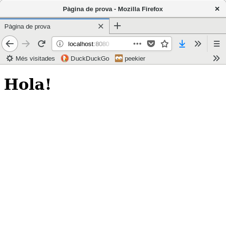

## Docker 1: Desplegar aplicació web

Docker es pot fer servir per poder treballar amb alguna aplicació web que necessiti un servidor però sense instal·lar-ne cap en el sistema on desenvolupem.

### Descarregar una imatge

En el repositori oficial d'imatges hi podem trobar la majoria dels servidors web de codi obert preinstal·lats: [nginx](https://hub.docker.com/_/nginx/), [Apache httpd](https://hub.docker.com/_/httpd/), [Tomcat](https://hub.docker.com/_/tomcat/) i fins i tot amb algun plugin instal·lat [Apache amb PHP](https://hub.docker.com/_/php/), [Wordpress](https://hub.docker.com/_/wordpress/), ...

En aquest moment tenim un fitxer HTML en el directori que volem veure a través d'un servidor web (no és cap meravella)

```bash
cat index.html
```

    <!DOCTYPE html>
    <html lang="ca">
    <head>
        <meta charset="UTF-8">
        <meta name="viewport" content="width=device-width, initial-scale=1.0">
        <meta http-equiv="X-UA-Compatible" content="ie=edge">
        <title>Pàgina de prova</title>
    </head>
    <body>
        <h1>Hola!</h1>
    </body>
    </html>

Podem mostrar-lo en un contenidor Docker que tingui `nginx` instal·lat amb la comanda següent:

docker run --name server -p 8080:80 -v $PWD:/usr/share/nginx/html:ro -d nginx

Bàsicament li estem dient que:

* El nom del contenidor serà `server` (--name)
* S'hi podrà accedir en el port local `8080` que es mapeja amb `80` (-p). O sigui amb [http://localhost:8080](http://localhost:8080)
* Que la carpeta arrel d'NGINX sigui la mateix que la del directori local on estem `$PWD` (-v)
* Que el contenidor s'inicii com a daemon (-d)

Si no està en el repositori local començarà a descarregar-lo:

    8176e34d5d92: Downloading  22.05MB/22.5MB
    cb1142c3ae99: Downloading  19.25MB/21.95MB
    45b531966c63: Download complete

Un cop hagi acabat es mostrarà el fitxer `index.html` que hi ha en el directori actual (que és el que hem posat en la comanda `$PWD`



Si es canvia qualsevol cosa també canviarà el que es visualitza en el navegador
