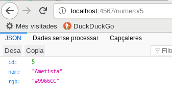
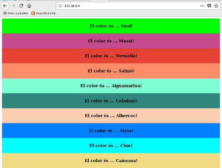

# Docker 4: Desplegar aplicacions complexes

En general en els contenidors només s'hi col·loca un servei concret (base de dades, servidor web, etc..). Per exemple si tenim una aplicació com Wordpress caldrà tenir tenir un servidor web amb PHP i una base de dades

A l'hora d'iniciar una aplicació complexa, caldrà tenir els diferents contenidors en marxa (i a vegades caldrà iniciar-los d'una forma determinada perquè sinó algun dels components no aconseguirà arrancar.

## **Docker compose**

La solució per aconseguir iniciar sistemes complexos són els sistemes d'orquestració. En Docker aquesta funció pot ser feta per **Docker compose**. Docker Compose permet fer servir divereses imatges i comunicar-les per obtenir els requisits necessaris per fer funcionar l'aplicació.

Tot i que la funció principal és la orquestració també pot fer altres tasques com:

* Construir imatges (a partir de Dockerfiles)
* Escalar contenidors
* Comprovar l'estat dels contenidors i reiniciar-los si han fallat

## **Configuració**

La configuració de l'orquestració es fa a través d'un fitxer yml: `docker-compose.yml`. En aquest fitxer s'hi especifica quins contenidors ha de tenir l'aplicació, com es construiran, quina configuració s'hi ha de definir, informació que volem que tingui, ...

```bash
cat docker-compose.yml
```

    version: '3'
    services:
        colorsservice:
            build: ./ColorsService
            ports:
             - 4567:4567
            depends_on:
             - db
        db:
            build: ./database
        front:
            build: ./frontend
            depends_on:
             - colorsservice

En general s'especifiquen els diferents contenidors com a serveis i se'ls hi assigna un nom. En el nostre cas són tres `colorsservice`, `db` i `front`. En versions anteriors els contenidors s'havien de lligar amb `link` però això no cal en les noves versions perquè es crea automàticament una xarxa privada.

A menys que es facin servir contenidors sense cap canvi, normalment la construcció de cada contenidor es definirà en un fitxer Dockerfile dins d'un directori

```bash
ls */
```

    ColorsService/:
    dependency-reduced-pom.xml  Dockerfile  pom.xml  target

    database/:
    Dockerfile  mysqld_charset.cnf  setup.sql

    frontend/:
    Dockerfile     nginx-default.conf  package-lock.json   node_modules   protractor.conf.js  tsconfig.json
    karma.conf.js  package.json        README.md           tslint.json

### **Servei 1: colorsservice**

El programa que hi ha dins del contenidor és un servei REST desenvolupat en Java que funciona en el port :4567. El servei retorna un color amb el seu valor RGB



Està desenvolupat en Java

```java
package net.xaviersala;
import static spark.Spark.*;

import net.xaviersala.db.ColorsDB;
import net.xaviersala.db.MySQLColorsDB;
import net.xaviersala.exceptions.ColorsException;

public class App
{
	static final ColorsDB servei = new MySQLColorsDB();

    public static void main( String[] args )
    {
    	// Obtenir el color a partir del nom
        get("/color/:color", (request, response) -> {
        	String elColor = request.params(":color");
        	return servei.getColor(elColor);
        }, new JSONTransformer());

        // Obtenir el color a partir de l'ID
        get("/numero/:num", (request, response) -> {
        	String num = request.params(":num");
        	return servei.getNumero(num);
        }, new JSONTransformer());

        // Obtenir en número d'ID màxim
        get("/maxid", (request, response) -> {
            return servei.getMaxID();
        }, new JSONTransformer());

        // Mostrar l'error quan es produeix una excepció
        exception(ColorsException.class, (exception, request, response) -> {
            response.status(404);
            response.body("{\"message\":\"" + exception.getMessage() + "\"}");
        	return;
        });
        // Capsaleres CORS
        before((request, response) -> {
            response.header("Access-Control-Allow-Origin", "*");
            response.header("Access-Control-Request-Method", "GET");
            response.header("Access-Control-Allow-Headers", "*");
            response.type("application/json");
        });
    }
}
```

Si es mira el fitxer Dockerfile es pot veure que el contenidor es crea en dues fases:

* FASE 1: Es parteix d'un contenidor amb Maven i el JDK al que se l'hi passa el programa i es compila
* FASE 2: S'agafa l'executable generat i s'executa en un contenidor que té el JRE

```bash
cat ColorsService/Dockerfile
```

    FROM maven:3.5-jdk-8 as BUILD

    RUN mkdir /app
    COPY src /app/src
    COPY pom.xml /app
    RUN mvn -f /app/pom.xml clean package

    FROM openjdk:8-jre
    WORKDIR /app/
    COPY --from=BUILD /app/target/ColorsService-0.0.1-SNAPSHOT.jar color.jar
    EXPOSE 4567
    CMD ["java","-jar","color.jar"]

### **Servei 2: base de dades (db)**

El servei de base de dades fa servir un contenidor de base de dades MySQL estàndard que s'ha configurat perquè tingui suport UTF-8 (charset.cnf) i perquè faci els inserts inicials

```bash
cat database/Dockerfile
```

    FROM mysql

    COPY mysqld_charset.cnf /etc/mysql/conf.d/mysqld_charset.cnf

    ENV MYSQL_ROOT_PASSWORD ies2010
    ENV MYSQL_DATABASE colors
    ENV MYSQL_USER color
    ENV MYSQL_PASSWORD ies2010

    ADD setup.sql /docker-entrypoint-initdb.d

El fitxer SQL és el responsable de crear la taula i fer els inserts inicials

```bash
head database/setup.sql
```

    DROP TABLE IF EXISTS color;
    CREATE TABLE color (id INT NOT NULL AUTO_INCREMENT, nom TEXT, rgb TEXT, PRIMARY KEY (id));
    insert into color (nom, rgb) values('Aiguamarina','#7FFFD4');
    insert into color (nom, rgb) values('Albercoc','#FBCEB1');
    insert into color (nom, rgb) values('Amarant','#E52B50');
    insert into color (nom, rgb) values('Ambre','#FFBF00');
    insert into color (nom, rgb) values('Ametista','#9966CC');
    insert into color (nom, rgb) values('Atzur','#007FFF');
    insert into color (nom, rgb) values('Beix','#F5F5DC');
    insert into color (nom, rgb) values('Bistre','#3D2B1F');

### **Servei 3: Frontend**

El servei Frontend conté una aplicació Angular4 que es desplega en un servidor NGINX.

També es crea amb dues fases:

* FASE 1: Dins d'un contenidor de Node.js es genera el paquet de producció de Angular
* FASE 2: S'agafa el directori de producció i es desplega a NGINX

## **Execució**

Amb una sola comanda es poden crear i desplegar tots els contenidors d'una tacada

```bash
docker-compose up
```

Només cal esperar i al cap d'una estona es trobaran els contenidors en marxa (en el nostre cas, la base de dades tarda més que els altres serveis)

```bash
docker ps
```

    CONTAINER ID        IMAGE                   COMMAND                  CREATED              STATUS              PORTS                    NAMES
    24b0e11c9826        docker4_front           "nginx -g 'daemon of…"   About a minute ago   Up About a minute   80/tcp                   docker4_front_1
    0d3e8dfe974d        docker4_colorsservice   "java -jar color.jar"    About a minute ago   Up About a minute   0.0.0.0:4567->4567/tcp   docker4_colorsservice_1
    05b79b6bf11b        docker4_db              "docker-entrypoint.s…"   About a minute ago   Up About a minute   3306/tcp                 docker4_db_1

I podrem accedir al servei fàcilment amb la IP del frontend

```bash
docker inspect docker4_front_1 | grep IPAddress
```

                "SecondaryIPAddresses": null,
                "IPAddress": "",
                        "IPAddress": "172.17.0.4",

Com que és un servidor web només cal posar l'adreça al navegador...



Clicant-hi a sobre amb el ratolí es regeneren tots els colors de la pantalla

Es pot veure que s'ha creat una xarxa que contindrà el grup de contenidors (docker4_default). Però es pot refinar tant com calgui i generar tantes xarxes com calgui

```bash
docker network ls
```

    NETWORK ID          NAME                DRIVER              SCOPE
    aa83f2871cb4        bridge              bridge              local
    6466f2259bea        docker4_default     bridge              local
    6f1571c024be        host                host                local
    d3d479e5ce72        none                null                local

Amb les comandes `docker network` se'n poden veure les característiques

En cas de voler aturar-ho tot n'hi ha prou amb executar

```bash
docker-compose down
```

### **Escalat**

Docker-compose és una eina que permet fer moltes coses a part d'iniciar contenidors:

* Iniciar, aturar i construir serveis
* Veure l'estat dels serveis en execució
* Veure els logs dels serveis
* Executar una comanda en un servei
* Escalar un servei a múltiples instàncies

Una de les coses que permet docker-compose i que és un gran avantatge a l'hora de desplegar un servei és la facilitat amb la que aquest servei pot ser escalat. Per exemple podem fer que hi hagi tres instàncies del servei `colorsservice`:

```bash
docker-compose up --scale colorsservice=3
```

Tornar a iniciar els contenidors que s'han aturat

```bash
docker-compose up --no-recreate
```
