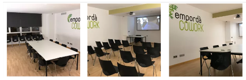

# 1ª Xerrada Informàtics Empordà
## dimarts 27 de febrer
## Sala Ubuntu Empordà Cowork

El proper dimarts dia 27 de febrer farem la primera xerrada tècnica organitzada per Informàtics Empordà. Serà a la sala Ubuntu del [Empordà Cowork](http://empordacowork.cat), C/ Carles Fages de Climent 36. 2n pis.

Després de la xerrada farem una estona de networking a la cafeteria Da Vinci, a 6 minuts a peu des d'Empordà Cowork.

### Agenda

- 20:15-20:30 **Benvinguda i Presentació**

> Ens trobem tots a la sala Ubuntu de l'Empordà Cowork per obrir la sessió.

- 20:30-21:10 **Desenvolupar amb Docker: Linux ha enamorat Microsoft** per [Xavier Sala](http://afegirurl.com)

> Que Docker ha afegit grans avantatges a l'hora de desplegar aplicacions és bastant conegut però també n'ha afegit a l'hora de desenvolupar les aplicacions. 
>
> La idea és mostrar els avantatges que aporta des del punt de vista dels desenvolupadors d'aplicacions

- 21:15- **Networking** 

> Un cop finalitzada la xerrada, passarem a la part _extraoficial_ amb :beer: i :fork_and_knife: Hem triat la [cafeteria Da Vinci que s'hi arriba a peu en pocs minuts des d'Empordà Cowork](https://www.google.es/maps/dir/Emporda+Cowork,+Figueres/Cafeteria+Da+Vinci,+Carrer+Mare+de+D%C3%A9u+de+Montserrat,+11,+17600+Figueres,+Girona/@42.2583027,2.9599835,17z/data=!4m14!4m13!1m5!1m1!1s0x12ba8dc014c7dc1f:0x757f19e7680433eb!2m2!1d2.9587698!2d42.2583604!1m5!1m1!1s0x12ba8dc79adbd9f7:0xc6a3c518c3b12ade!2m2!1d2.9655472!2d42.257846!3e2).

### Emplaçament Xerrada

_[Empordà Cowork a Google Maps](https://www.google.es/maps/place/Emporda+Cowork/@42.2583604,2.9577309,18z/data=!3m1!4b1!4m5!3m4!1s0x12ba8dc014c7dc1f:0x757f19e7680433eb!8m2!3d42.2583604!4d2.9587698)_

### Emplaçament Networking

_[Itinerari recomenat per arribar a Da Vinci des de Cowork Empordà](https://www.google.es/maps/dir/Emporda+Cowork,+Figueres/Cafeteria+Da+Vinci,+Carrer+Mare+de+D%C3%A9u+de+Montserrat,+11,+17600+Figueres,+Girona/@42.2583027,2.9599835,17z/data=!4m14!4m13!1m5!1m1!1s0x12ba8dc014c7dc1f:0x757f19e7680433eb!2m2!1d2.9587698!2d42.2583604!1m5!1m1!1s0x12ba8dc79adbd9f7:0xc6a3c518c3b12ade!2m2!1d2.9655472!2d42.257846!3e2)_
