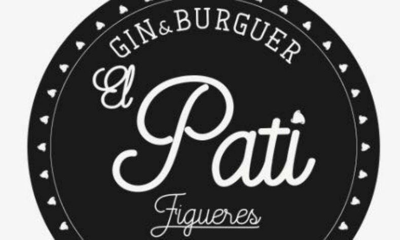

# 2ª Xerrada Informàtics Empordà

# Dimarts, 24 d'abril

# Restaurant El Pati

El dimarts dia 24 d'abril farem la segona jornada de xerrades organitzada per Informàtics Empordà. Serà al restaurant El Pati, c/ Muralla, 7

Després de les xerrades ens quedarem a sopar al mateix restaurant.

## Agenda

El restaurant disposa de servei de bar a partir de les 17:00, així que els qui vulguin podràn assistir abans.

* 20:15 **Benvinguda i Presentació**

> Ens trobem tots al restaurant El Pati per obrir la sessió.

* 20:30-21:15 **Apps amb tencologia web** per [Xavier Sala](https://utrescu.github.io)

> Fins ara quan es volien desenvolupar APP mòbils que es puguin executar en tots els dispositius implicava desenvolupar, almenys, dues aplicacions diferents: una per Android i una per IOS. Els coneixements necessaris per fer-ho han estat una barrera important per als desenvolupadors web...
>
> Es pot aprofitar el que els desenvolupadors web ja saben fer per crear APPs multiplataforma? El món s'acaba... Desenvolupadors web fent APPs!

[Descarregar Transparències](WebApps/AppsWeb.pdf)

* 21:15-22:00 **Productivitat amb Scrum, Trello i Slack** per [Esteve Aguilera](https://esteveaguilera.github.io)

> Com millorar la productivitat utilitzant el framework Scrum i les eines Trello i Slack.

* 22:00 **Sopar** Un cop finalitzades les xerrades, ens quedarem a sopar al mateix restaurant per a seguir amb el networking.

### Emplaçament

